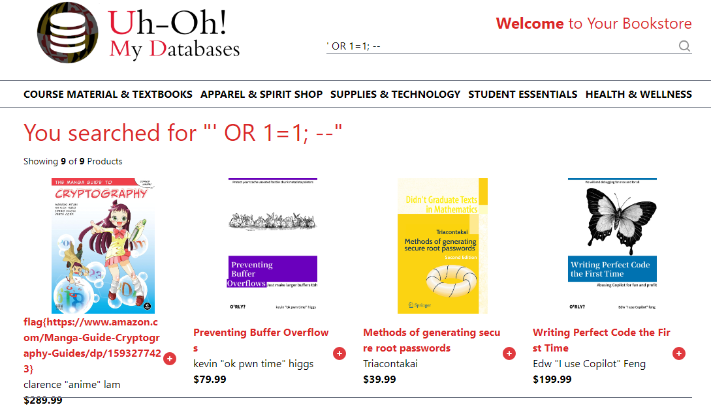
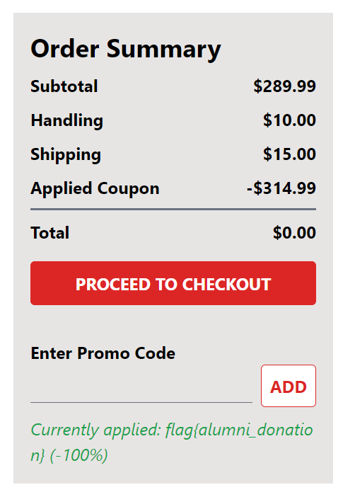
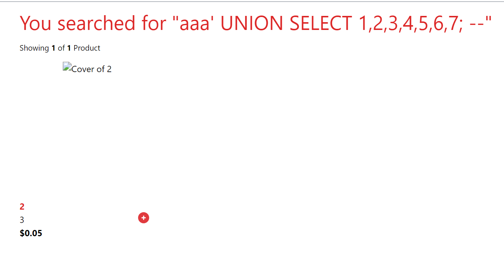
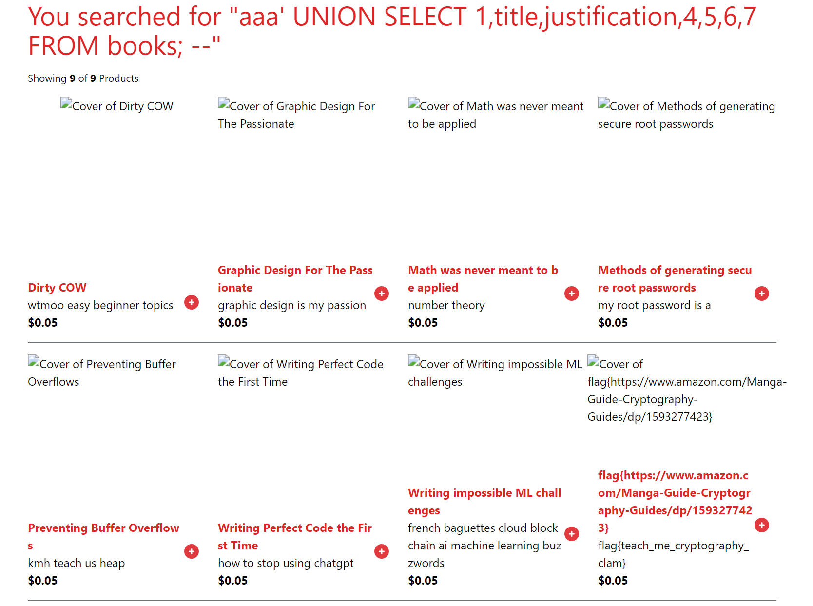
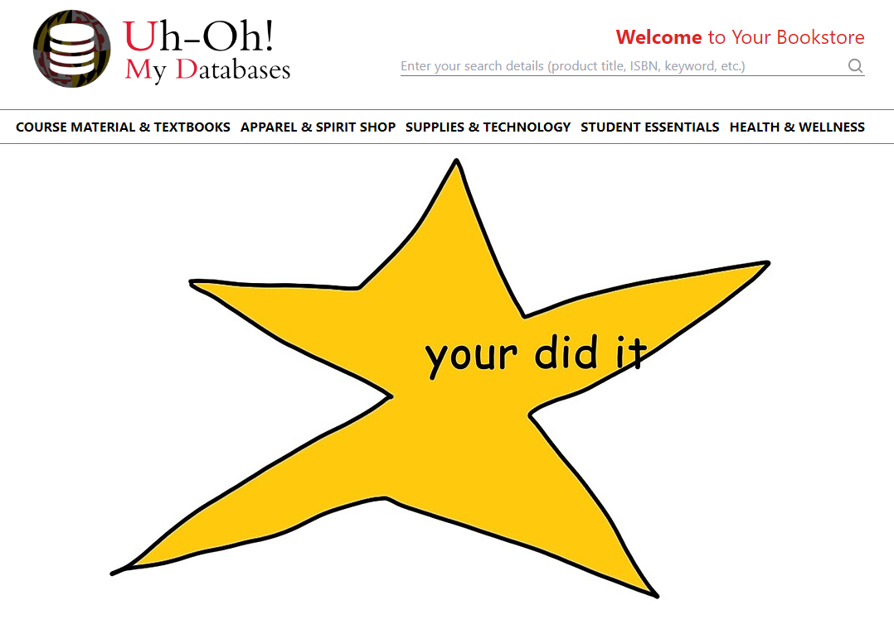
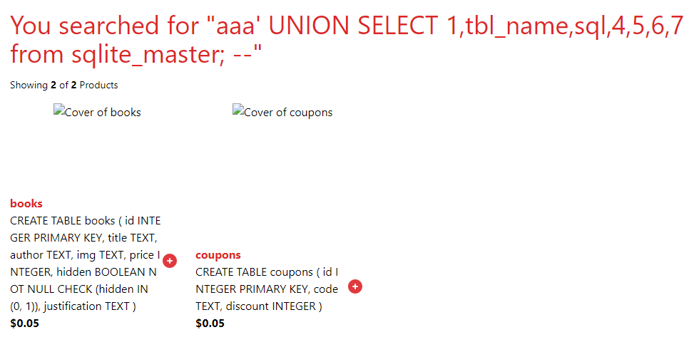

# SQL Injection in Bookstore

Last meeting, we learned about SQL syntax and how attackers can leverage injection into SQL queries for various purposes. Below is a walkthrough of how to exploit the SQL injection vulnerabilities in our site.

## Getting started
On the footer of the website is a [link](https://sqliteonline.com/#urldb=https://books.umdctf.io/static/bookstore.db) to view a (cleaned) copy of the website database. This provides us with the structure of the website database so we don't have to guess table and column names. You also could have also gotten the database structure from looking at the init.py file in the source code, or by using the master table (see the Addendum section for details).

## Task 1: Finding the hidden book
From the home page, there's only one place to put in data, which is the search box. We can just do an empty search and get a list of 8 books. But the hidden book doesn't show up here. To see why, let's take a look at the code that executes the SQL query (you can find it [here](../app.py#L37)):
```python
cur = db.execute(f"SELECT * FROM books WHERE title LIKE '%{query}%' AND hidden = 0")
```
We can see that under normal operation, the query selects books according to your query, but excludes any books that don't have `hidden` set to 0. We also could have inferred this from our copy of the database, since the `books` table has a `hidden` column which is set to 0 for all the displayed books.

To show the hidden book, we can input the standard injection query `' OR 1=1; --`. Let's break this down:
- The `'` closes the single quote and breaks us out of the string.
- `OR 1=1` adds a condition that the row should be selected if `1=1`, which is always true. The result is that every book in the `books` table gets selected.
- `;` completes the current statement. This isn't strictly necessary, but it's good practice.
- `--` is the symbol to comment out the rest of the query so that we don't need to deal with it.

This ends up selecting all books from the database, including the hidden book.



Flag for this part: `flag{https://www.amazon.com/Manga-Guide-Cryptography-Guides/dp/1593277423}`

Follow-up: The 3-character input `'--` also shows us the hidden book. Can you see why?

## Task 2: Finding the promo code for free books
Let's add the hidden book to our cart. This costs quite a bit, but there's a promo code section which might give us a discount. If we try the standard `' OR 1=1; --`, then we get a valid promo code! Unfortunately, it's the code for differential tuition, which gives us `--15%`, or `+15%` on our order.

Somehow we need to find a promo code that gives us a better discount. There are a few ways to go from here, but the intended path was to use a query to filter for good promo codes.

If we look at the `coupons` table in our copy of the database, we see a column called `discount`, which stores the percent to take off of the purchase. So, we'll just add an extra clause that looks for coupons that could give us the books for free. One input that accomplishes this is `' OR discount >= 100; --`, which selects all coupons that have a blank name (of which there are none) or that have a discount of at least 100%. Entering this into the promo code field gives us the code for free books.



Flag for this part: `flag{alumni_donation}`

## Task 3: Finding justification for book purchases
After proceeding to checkout, we are asked to provide a justification for this purchase. In the `books` table of our copy of the database, there's a `justification` column that isn't shown to us. Can we get the website to show it to us somehow?

The solution lies in the `UNION` keyword, which lets us join the results of two `SELECT` clauses together in the same SQL statement. We start off with the following input, which we put in the book search box:
```
aaa' UNION SELECT 1,2,3,4,5,6,7; --
```
First, we put `aaa` as a search term, which filters out all the books since none of them have `aaa` in the title (This isn't necessary, but it cleans up the results a bit).

The `UNION` keyword ends the current `SELECT` clause, and lets us start another one. Here, we're selecting the values `1,2,3,4,5,6,7`. Why 7 values? If we try selecting 6 or 8 values, the website errors. In order to join the results together, `UNION` requires that the result of both `SELECT` clauses have the same number of columns. The first clause selects 7 columns from the `books` table, so we need to select 7 columns in the second clause (if we didn't know this, we could have tried selecting 1 column, 2 columns, etc. until the website didn't error).

The result of the query is shown below:



It seems that columns 2 and 3 are displayed to us in text, and column 5 is treated as a numeric cost. To get the justifications, we modify our query:
```
aaa' UNION SELECT 1,title,justification,4,5,6,7 FROM books; --
```
Now, instead of selecting the numbers 2 and 3, we select the title and justification columns from the `books` table. This gives us the following result:



Flag for this part: `flag{teach_me_cryptography_clam}`

Follow-up: We could have solved Task 2 in a similar way by displaying the contents of the coupons table. Can you find an input that does this?

## Task 4: Logging in as the admin
We enter the flag to the previous part as our justification for the hidden book. The last part is to log in as the admin. The source code of the login page can be seen [here](../app.py#L153).

First, we notice that if we try to log in with any username that isn't `admin`, the error returned is `User not found`. But if we log in with the username `admin`, the error is `Invalid username or password`. Also, if we put in the query `' OR 1=1; --`, we also get `Invalid username or password`. So, we get a different response depending on whether the SQL query returned a row or not, which we can exploit to find the admin password.

The script for finding the password is in [blind.py](./blind.py), which requires the [requests module](https://pypi.org/project/requests/) to be installed. See if you can understand what it's doing!

After finding the password, we can log in as the admin, and get a congratulatory message.



Flag for this part: `flag{nobodyisguessingthisonelmao}`

Follow-up: If you didn't know that the password column was named `password`, is there another way you could have figured that out?

## Addendum: Determining database structure
Suppose we didn't have the source code or a copy of the website database. How could we find the structure of all the tables? The answer lies in the `sqlite_master` table, which is a meta-table (table that describes other tables) in SQLite, the flavor of SQL that we're using in this website. If we apply a similar process as we did in step 3, we can put a query in the search box that gives us the columns of the `sqlite_master` table that we need.
```
aaa' UNION SELECT 1,tbl_name,sql,4,5,6,7 from sqlite_master; --
```
Result below:


This gives us the table and column names, as well as the column types, which tells us what we need to know about the structure of the tables.
